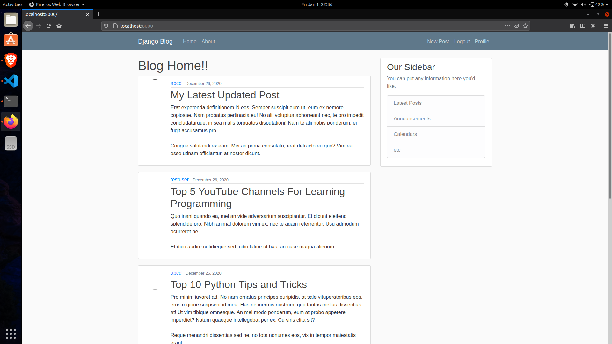

# Django Blogger

This project is a website using django as a backend where you can post
blogs.




## Technologies
* Python 3.8
* Django 3.5

## Setup
```
$ run pip install django
$ run pip install django-crispy-forms
$ run pip install pillow
```


