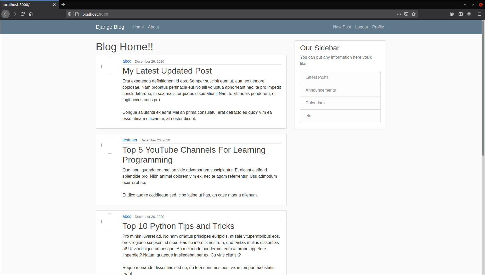

# Django Blog

This project is a website using django as a backend where you can post
blogs.


<h1> Check out the live deployed website  </h1>
<h2> --> http://neat-blogs.herokuapp.com <-- Copy paste link in browser :) </h2>




## Technologies
* Python 3.8
* Django 3.5

## Setup
```
$ pip install django
$ pip install django-crispy-forms
$ pip install pillow
$ pip install django-ckeditor
```
